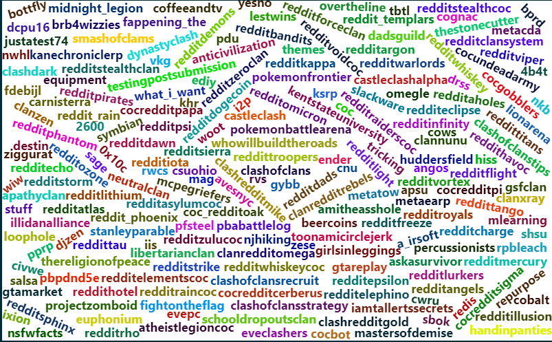

```{r PACKAGES, include=FALSE}
library(tidyverse)
library(knitr)
library(ggplot2)
library(wordcloud2)
library(circlize)
library(stats)
library(igraph)
library(Matrix)
library(rARPACK)
library(ggwordcloud)
library(wordcloud)
```

## Introduction

### Clustering and Project Task

A common workhorse found in the toolbox of data scientists is the notion of clustering. The core of clustering is constructing a rule that partitions observations into some number of groups. The simplest example of this tool is an algorithm like k-Nearest Neighbors which looks at data in a euclidean metric space (x-y coordinates) and tries to ensure that each cluster or group is composed of the most compact set of points possible. This problem is intuitive in the case of two dimensional point clouds (i.e. scatter plots) but the underlying principle works well in general if one can construct an appropriate metric space for a set of observations. This project aims to understand how using concepts from spectral graph theory allows a network of linked online forums (subreddits) to be partitioned into groups. The Excalibur that will cut through the abstract nature of a network diagram and give way to a meaningful clustering algorithm is the graph Laplacian. 

### Laplacians and Spectral Theory

That begs the question, "What is a Laplacian and what more specifically is a graph Laplacian?" A Laplacian is a mathematical operator like the derivative. It is precisely defined as the divergence of the gradient. This is a clean,  mathematical way of saying that the Laplacian takes a function of interest and tells you how much the speed of change is changing for a given point. How is that useful for clustering? The graph Laplacian can be thought of as a way to measure a cognitive phenomena attributable to the Gestalt Law of Closure where a person sees connected components in a point cloud or other image. Humans are able to make the educated guess that despite being further than other points, points which seem to form a continuous shape are likely connected in some way. The graph Laplacian allows this intuition to be abstracted into a tool which works on network diagrams and other scenarios where one cannot see the space which the data exists in. 

The specific definition of the graph Laplacian is the difference of the degree matrix and the weight or similarity matrix of a network. The weight or similarity matrix is like an adjacency matrix where the entries indicate how strongly connected two nodes in our graph are. The degree matrix is just a diagonal matrix where each nonzero entry is the sum of the edge weights for the node it represents. This is a looser definition than you would find in a textbook, but it is fine for the purposes of this report

## Data

```{r LOAD_DATA, include=FALSE}
body_links =  read_delim("soc-redditHyperlinks-body.tsv", 
    "\t", escape_double = FALSE, col_types = cols(POST_ID = col_skip(), 
        TIMESTAMP = col_skip(), LINK_SENTIMENT = col_skip(), 
        PROPERTIES = col_skip()), trim_ws = TRUE)
```

The data for this project comes from Stanford University's SNAP datasets specifically their [Social Network: Reddit Hyperlink Network Data](https://snap.stanford.edu/data/soc-RedditHyperlinks.html). The data is compromised of two data sets which record hyperlinks from one subreddit to another in either the title or body of a post on Reddit. This project only considers the data set of body links for the sake of being manageable.

### Description

Variables Imported:

- `SOURCE_SUBREDDIT`: A string containing the name of the subreddit where the post was made
- `TARGET_SUBREDDIT`: A string containing the name of the subreddit linked to in the body of the post

Basic Information:

- **Number of Observations**: `r nrow(body_links)`
- **Number of Unique Source Subreddits**: `r length(unique(body_links$SOURCE_SUBREDDIT))`
- **Number of Unique Target Subreddits**: `r length(unique(body_links$TARGET_SUBREDDIT))`

### Frequency of Connections

```{r FREQ_CONN, echo=FALSE}
body_links_freq = body_links %>% 
  count(SOURCE_SUBREDDIT, TARGET_SUBREDDIT) %>% 
  mutate(freq = n / sum(n)) %>% 
  distinct() %>% 
  unite('SOURCE_TARGET', SOURCE_SUBREDDIT, TARGET_SUBREDDIT, remove = FALSE)

ggplot(head(body_links_freq[order(-body_links_freq$n),], 10), 
       aes(x = SOURCE_TARGET, y = n)) + 
  geom_bar(stat="identity") + 
  theme(axis.text.x = element_text(angle = 90)) +
  coord_flip() + 
  xlab("Source and Target") + 
  ylab("Count") + 
  ggtitle("Top Ten Connections")
```

```{r WORD_CLOUD, echo=FALSE, fig.height=5, fig.width=8}
wordcloud2(head(body_links_freq[order(-body_links_freq$n),], 100)[c("SOURCE_TARGET", "freq")], size = 0.33)
```
The visualizations above show the top ten connections' source and target as a bar chart and then a word cloud of connections. It's clear from this that the most frequent connections are related subreddits like `outoftheloop_askreddit` or `buildapc_pcmasterrace`. The outlier is `trendingsubreddits_changelog` which are two meta forums that track trends on the site and cross post frequently.

### Diversity of Connections

```{r DIV_CONN, echo=FALSE}
body_links_div = body_links %>% 
  group_by(SOURCE_SUBREDDIT) %>% 
  mutate(div = n_distinct(TARGET_SUBREDDIT)) %>% 
  select(SOURCE_SUBREDDIT, div) %>% 
  distinct()

ggplot(head(body_links_div[order(-body_links_div$div),], 10), 
       aes(x = SOURCE_SUBREDDIT, y = div)) + 
  geom_bar(stat="identity") + 
  theme(axis.text.x = element_text(angle = 90)) +
  coord_flip() + 
  xlab("Source Subreddit") + 
  ylab("Number Of Unique Connections") + 
  ggtitle("Top Ten Most Diverse Source Subreddits")
```

```{r CHORD_DIAG, echo=FALSE}
top_ten_div_data = body_links %>% 
  filter(SOURCE_SUBREDDIT %in% (body_links_div[order(-body_links_div$div),])[1000:1010,]$SOURCE_SUBREDDIT)
  
circos.par(gap.degree = 0.1)
chordDiagram(top_ten_div_data, annotationTrack = NULL)
title("1000th - 1010th Most Diverse Sources")
circos.clear()
```

The most diverse connections provides some great insights into how difficult this data could be to work with. The most diverse source has over 1250 unique targets. The overall trend amongst highly diverse sources is their relationship to drama or discussion of other subreddits. Again, the metaforums seem to dominate the activity and may prove to be outliers that need to be pruned.The unwieldly nature of the data is highlighted by the chord diagram which needed to use the 1000-1010th most diverse sources to render. The highly connected data would be difficult to analyze outside of proper graph analysis.

## Analysis

### Constructing the Similarity and Degree Matrices

The similarity matrix can be calculated in this case as a simple weighted adjacency matrix using `igraph`. The `Matrix` sparse matrix utilities makes the calculations feasible and taking the difference of the degree and adjacency matrix gives the graph Laplacian. Calculating the smallest nonzero eigenvalue and its eigenvector for the graph Laplacian yields a Fiedler vector which can be used to classify the data.

```{r SIM_MAT}
nodes = unique(unlist(body_links))
body_links_graph = graph_from_data_frame(d = body_links, vertices = nodes, directed = FALSE)
adj = get.adjacency(body_links_graph)
deg = Diagonal(35776, degree(body_links_graph))
graphLap = deg - adj
e = eigs(graphLap, k=20, which="SM")
```

```{r CLASS}
fiedler = e$vectors[,which.min(e$values)]
fiedler_classifier = ifelse(fiedler > 0, 1, 0)
classified_subs = data.frame(sub = unique(unlist(append(body_links$SOURCE_SUBREDDIT, body_links$TARGET_SUBREDDIT))), class = fiedler_classifier)
```

The Fiedler vector is essentially a way to optimize the partitioning of a graph which is what the clustering problem has been reduced to. After partitioning, the classifier has placed `r round(sum(classified_subs$class == 1)/nrow(classified_subs)*100, 2)`% of the observations in one cluster and the rest in the remaining cluster. 

## Conclusion and Results

Earnestly, my hypothesis was that the classifier would separate out the metaforum pages like r/changelog or r/trendingsubreddits. The final result was fascinatingly more poignant. 



Looking at this wordcloud for a while it starts to become clear that the spectral clustering was able to pick out all of the Clash Of Clans' subreddits. There is a lot of noise, but that's expected in a dataset of this size. The original progenitor of this dataset was a study on how subreddits pick fights with one another and in that vain it makes sense that subreddits for larger clans on Clash of Clans would create a structure that the algorithm would pick out. These subreddits are all of relatively similar size and link to one another at a similar frequency. The shape in the space of links between Clash Of Clans subreddits is far more structured than most communities on Reddit. Further work could involve using more data cleaning and applying a more technical treatment of spectral clustering to better isolate the Clash Of Clans community. It would also be interesting to apply a multiclass spectral clustering approach to see what other communities could be pulled from this dataset.

